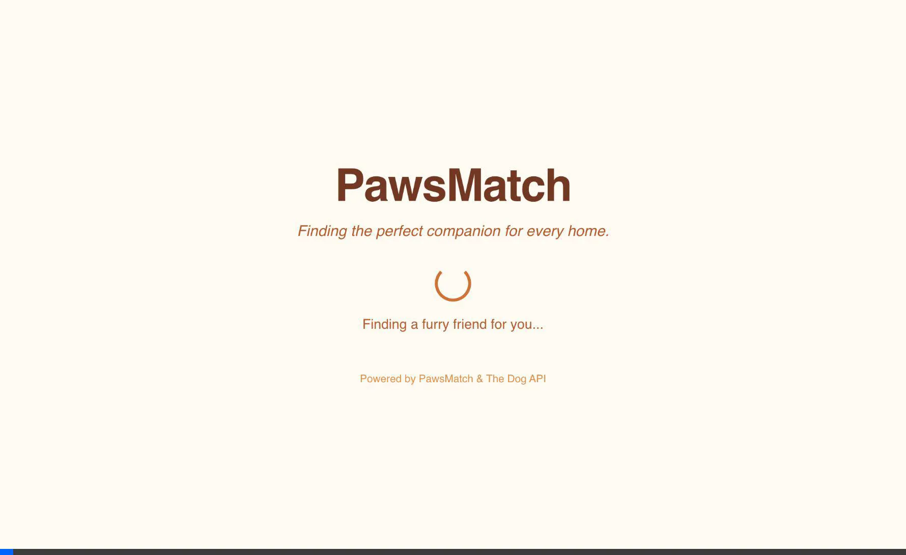

# PawsMatch




PawsMatch is a pet adoption application designed to connect loving families with pets in need of a home. The application features a warm and friendly design with a modern technical stack and a premium, mobile-first user experience.

> **Language**: The UI is fully localized in Spanish (es-GT).

## Tech Stack

- **Vite (v7.2+)**: Next-generation frontend tooling for fast development and optimized builds.
- **React (v19+)**: A JavaScript library for building user interfaces with a focus on component-based architecture.
- **Tailwind CSS (v4+)**: Utility-first CSS framework with a CSS-first configuration and high-performance engine.
- **TypeScript**: Static typing for enhanced developer experience and code reliability.
- **Framer Motion**: Production-ready motion library for React, powering smooth swipe animations and micro-interactions.
- **Lucide React**: Beautiful, consistent icon library with tree-shaking support.

## Architecture

The project follows a standard React directory structure in the `app/` folder:

- `app/src/components/`: Reusable UI components.
  - [`PetCard.tsx`](app/src/components/PetCard.tsx): Swipeable pet card with glassmorphism styling, drag-based interactions, and animated Like/Pass indicators.
  - [`AdoptionConfirmation.tsx`](app/src/components/AdoptionConfirmation.tsx): Adoption confirmation screen with shelter info, contact details, and visit scheduling options.
- `app/src/hooks/`: Custom React hooks for shared logic.
  - [`usePetStack.ts`](app/src/hooks/usePetStack.ts): Manages the pre-fetch buffer for zero-latency pet card transitions.
- `app/src/services/`: API and data fetching services.
  - [`petProvider.ts`](app/src/services/petProvider.ts): Handles integration with The Dog API and maps remote images to local pet bios.
- `app/src/types/`: TypeScript interfaces and type definitions.
- `app/src/data/`: Static assets and mock data.

## UI/UX Features

### Mobile-First Design
- **Responsive Layout**: Optimized for mobile devices with safe-area inset support for notched displays.
- **Touch-Optimized**: Large touch targets, swipe gestures, and haptic-feeling animations.
- **Dynamic Viewport**: Uses `dvh` units to handle mobile browser chrome properly.

### Glassmorphism Design System
- **Frosted Glass Effects**: Semi-transparent backgrounds with `backdrop-blur` for depth.
- **Layered Transparency**: Multiple opacity levels create visual hierarchy.
- **Soft Shadows**: Subtle shadow casting enhances the floating card aesthetic.

### Swipe Interactions (Powered by Framer Motion)
- **Drag-to-Swipe**: Cards can be dragged left (Pass) or right (Like) with natural physics.
- **Visual Feedback**: Dynamic "LIKE" and "PASS" badges appear based on swipe direction.
- **Spring Animations**: Cards snap back or fly off-screen with satisfying spring physics.
- **Rotation Effect**: Cards tilt naturally as they're dragged, mimicking physical cards.

### Micro-Interactions
- **Button Hover States**: Subtle scale and shadow transitions on interactive elements.
- **Loading States**: Smooth spinner animations during data fetching.
- **Entry Animations**: Cards and UI elements fade and slide into view.
- **Icon Animations**: Playful logo animation adds personality.

### Adoption Flow
The app implements a complete adoption flow with multiple screens:

```
┌─────────────┐      Adopt      ┌─────────────────────┐    Schedule     ┌─────────────────┐
│   Browse    │ ───────────────▶│   Adoption Info     │ ───────────────▶│    Success      │
│  (Swipe)    │                 │ (Contact/Schedule)  │                 │ (Confirmation)  │
└─────────────┘                 └─────────────────────┘                 └─────────────────┘
      ▲                                   │                                      │
      │           Keep Browsing           │          Continue Browsing           │
      └───────────────────────────────────┴──────────────────────────────────────┘
```

1. **Browse**: Main screen with swipeable cards (swipe right = Like, left = Pass)
2. **Adoption Info**: Shelter details, phone, email, and visiting hours
3. **Success**: Visit confirmation with option to continue exploring

## Design System

PawsMatch uses a "warm and friendly" color palette configured in `app/src/index.css` using Tailwind CSS 4's `@theme` block. This includes:
- **Warm Palette**: Earthy oranges and browns for a cozy feel.
- **Friendly Palette**: Soft greens for growth and positivity.
- **Primary Palette**: Sunny yellows for energy and optimism.
- **Typography**: Clean, modern sans-serif fonts (Inter/SF Pro) for readability and a premium aesthetic.

## Getting Started

1.  Navigate to the `app/` directory.
2.  Install dependencies: `npm install`
3.  Run development server: `npm run dev`
4.  Build for production: `npm run build`

## Asset Generation

To generate fresh mock data for the application, use the provided Python script in the `asset-generation/` directory. This script uses Google's Gemini API to create unique dog profiles.

### Prerequisites
- Python installed
- `uv` package manager (recommended) or `pip`
- A Google Cloud project with Vertex AI enabled or a Gemini API key

### Running the Generator

1.  Navigate to the `asset-generation/` directory.
2.  Set your API key:
    ```bash
    export GEMINI_API_KEY="your_api_key_here"
    ```
3.  Run the script:
    ```bash
    # Using uv (recommended)
    uv run main.py

    # Or using standard python
    # pip install -r requirements.txt (if available)
    python main.py
    ```
4.  The script will generate a new `pets.json` file. Copy this file to `app/src/data/pets.json` to update the app data.

## Pet Provider Implementation Analysis

### 1. Local Data Source of Truth
Based on `src/types/pet.ts` and `src/data/pets.json`, our local data structure is:

**Interface (`src/types/pet.ts`):**
```typescript
interface Pet {
  id: number;
  name: string;
  bio: string;
}
```

**Data (`src/data/pets.json`):**
Array of `Pet` objects, e.g.:
```json
{
  "id": 1,
  "name": "Max",
  "bio": "Soy un golden retriever..."
}
```

### 2. API Integration Strategy
**Target API:** `https://dog.ceo/api/breeds/image/random`

**Response Structure:**
The API returns a JSON object where the image URL is located in the `message` property.

- **JSON Path:** `$.message`
- **Example Response:**
  ```json
  {
      "message": "https://images.dog.ceo/breeds/terrier-welsh/lucy.jpg",
      "status": "success"
  }
  ```

### 3. Mapping Logic
To create a complete pet profile, we will merge the static text data with the dynamic image data:

1.  **Fetch Random Image:** Call `fetch('https://dog.ceo/api/breeds/image/random')`.
2.  **Extract URL:** Parse JSON and access `data.message`.
3.  **Select Text Data:** Randomly select one `Pet` object from the local `pets.json` array.
4.  **Merge:** Create a unified object containing the local `id`, `name`, `bio` and the remote `imageUrl`.

### 4. TypeScript Interface
We will extend the existing `Pet` interface to include the image URL. This ensures backward compatibility while accommodating the new data.

```typescript
import { Pet } from '../types/pet';

export interface PetProfile extends Pet {
  imageUrl: string;
}

// API Response type for internal use
interface DogApiResponse {
  message: string;
  status: string;
}
```

### 5. Error Handling Strategy
We will implement a resilient strategy to handle API failures:

- **Primary Error Handling:** Wrap the API call in a `try-catch` block.
- **Failover:** If the API request fails (network error, non-200 status, or malformed JSON), the system will fallback to a default "placeholder" image URL (e.g., a local asset or a reliable public placeholder like `https://images.dog.ceo/breeds/retriever-golden/n02099601_3004.jpg`).
- **User Feedback:** Fails should be logged to the console for debugging, but the user UI should effectively show the pet with a default image rather than an error state, preserving the "warm and friendly" experience.

### 6. Performance Strategy: Pre-fetch Stack
To ensure a zero-latency "app-like" experience, we implemented a **Pre-fetch Stack** architecture:

- **Buffer**: We maintain a buffer of 3 upcoming pets in memory (`usePetStack.ts`).
- **Background Fetching**: As the user swipes (clicks Pass/Adopt), the next card is instantly available from memory. A background request is triggered to replenish the stack.
- **Image Pre-loading**: The application renders a generic hidden `` element for the *next* pet in the stack. This forces the browser to download and cache the image before it's ever shown to the user, eliminating pop-in and layout shifts.
- **StrictMode Compatible**: Uses `useRef` guards to prevent double initialization in React 18+ StrictMode during development.
