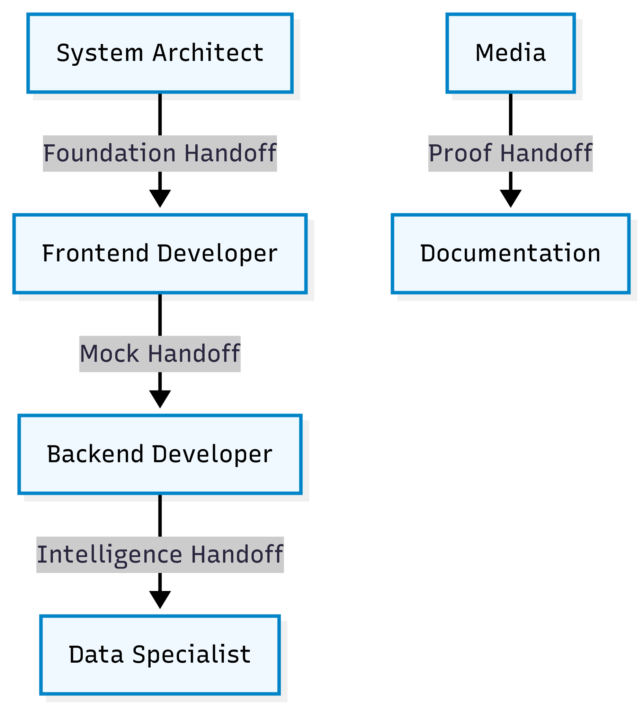

<!-- _class: lead -->

# SDLC Role Relations
## Understanding the Agentic Handoffs
### Week 2 Reference

---

# Overview of Relations

---

# 1. System Architect $\rightarrow$ Frontend Developer
**"The Foundation Handoff"**

*   **Source Role**: System Architect
*   **Target Role**: UI/UX Frontend Developer
*   **The Content**:
    *   `package.json` & Library selections (e.g., `shadcn/ui`, `tailwindcss`).
    *   Folder Structure (`src/components`, `src/app`).
*   **The Direct Relation**:
    The Frontend Developer **cannot start** without the tools installed by the Architect. If the Architect fails to install `shadcn`, the Frontend prompts will fail.

---

# 2. Frontend Developer $\rightarrow$ Backend Developer
**"The Mock Handoff"**

*   **Source Role**: UI/UX Frontend Developer
*   **Target Role**: Backend Developer
*   **The Content**:
    *   UI Components with *mock data* (hardcoded strings).
    *   Component Props definition (The "Contract").
*   **The Direct Relation**:
    The Backend Developer's job is to **replace** the Frontend's mocks with real data. They must strictly adhere to the data structure (props) defined by the UI to avoid breaking the display.

---

# 3. Backend Developer $\rightarrow$ Data Specialist
**"The Intelligence Handoff"**

*   **Source Role**: Backend Developer
*   **Target Role**: Data Specialist
*   **The Content**:
    *   Working API services (e.g., Unsplash Fetcher).
    *   Verified data flow.
*   **The Direct Relation**:
    The Data Specialist uses the *working data layer* to build the AI features. We separate these so we know if a failure is due to *data fetching* (Backend responsibility) or *AI Generation* (Data Specialist responsibility).

---

# 4. Media $\rightarrow$ Documentation
**"The Proof Handoff"**

*   **Source Role**: Media (Role 7)
*   **Target Role**: Documentation (Role 8)
*   **The Content**:
    *   Screenshots and Walkthrough Videos (`assets/home_demo.webp`).
*   **The Direct Relation**:
    The Documentation role embeds the assets created by the Media role into the `README.md` to prove the application works and looks as intended.
