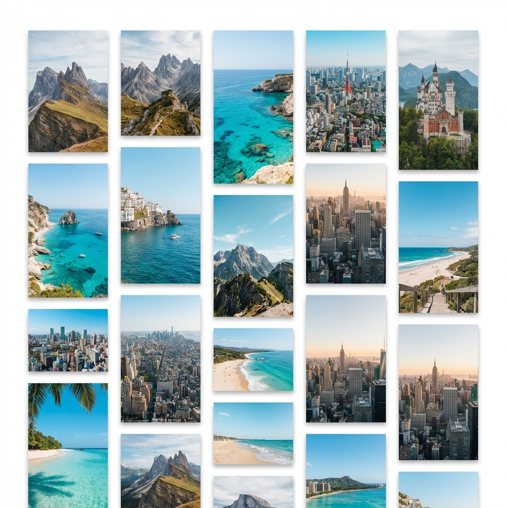
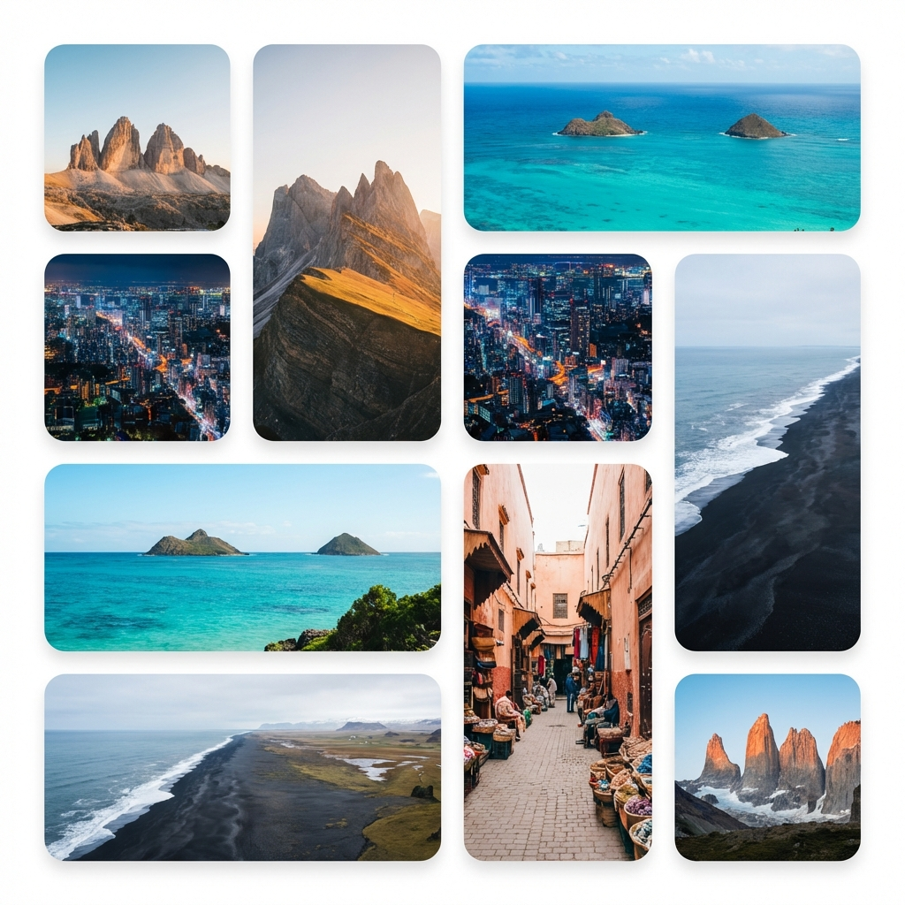
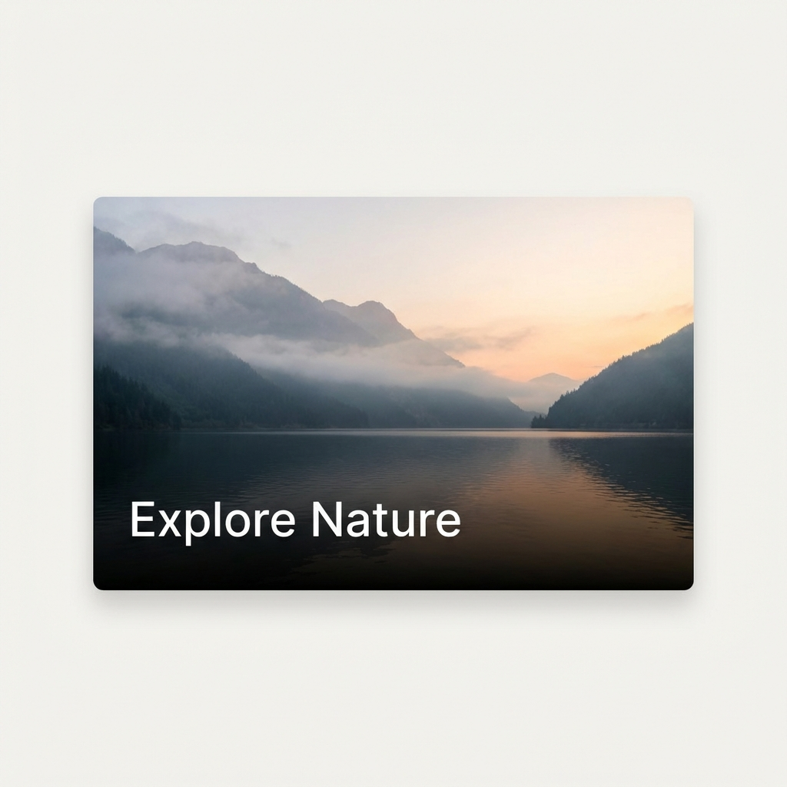
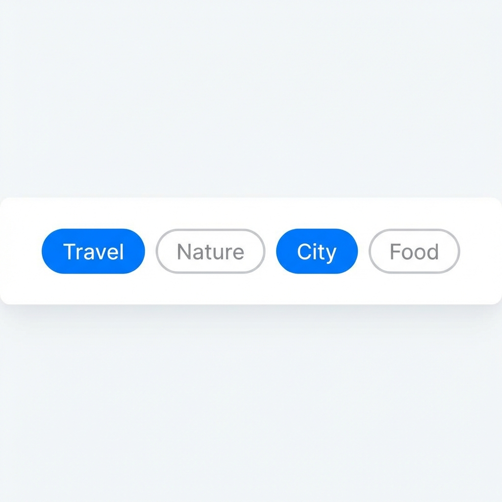

<!-- _class: lead -->

# AI Native Dev
## UI Glossary
### Week 2 Reference

---

# UI Glossary Overview

This document defines key User Interface (UI) and User Experience (UX) terms mentioned in the Week 2 slides, particularly focusing on the "TraveLens" application design.

**Key Concepts:**
*   Layout Patterns (Masonry, Bento)
*   Visual Style (Glassmorphism, Overlays)
*   Design Principles (Gestalt, Hierarchy)

---

# Masonry Grid

A layout style where items are placed in optimal positions based on available vertical space, similar to stones in a masonry wall.

*   **In TraveLens**: Used for the "Visual Discovery" homepage.
*   **Why**: Accommodates images of varying aspect ratios (portrait/landscape) without large gaps, unlike a strict row/column grid.
*   **Implementation**: Often achieved with CSS Columns (`columns-3`) or specific JS libraries (though CSS is preferred for performance).

---

# Bento Grid

A grid layout inspired by Japanese bento boxes, characterized by structured, rectangular compartments of varying sizes that align to a comprehensive grid.

*   **In TraveLens**: Used for the "Similar Destinations" sidebar.
*   **Why**: Creates a clean, hierarchical way to display related content. It feels organized and "tech-forward" (popularized by Apple promotional materials).

---

# Glassmorphism

A visual style that simulates the look of frosted glass (translucency) floating over a background.

*   **Characteristics**:
    *   Background blur (`backdrop-filter: blur()`).
    *   Semi-transparent backgrounds (white/black with low alpha).
    *   Subtle white borders to mimic the glass edge.
*   **Use Case**: Adds depth and a "Premium" feel to UI cards and overlays.

---

# Hero Section

The prominent top section of a web page, typically containing a large image, a headline, and a call-to-action (CTA).

*   **In TraveLens**: The "Left Panel" of the detail view acts as the Hero.
*   **Key Design**: Uses a high-resolution image to grab attention immediately.

---

# Clean Overlay

A text or graphic layer placed on top of an image that is legible but unobtrusive.

*   **Technique**: often involves a gradient fade (black to transparent) behind the text to ensure contrast against the underlying image.
*   **Constraint**: "Display only Title and Tags" to avoid visual clutter and maintain the "Premium" aesthetic.

---

# Visual Hierarchy

The arrangement of elements in a way that implies importance.

*   **Principle**: Look at the most important thing first.
*   **Application**:
    1.  **Large Images**: Primary focus (Emotional draw).
    2.  **Bold Titles**: Secondary focus (Context).
    3.  **Metadata (Tags/Location)**: Tertiary focus (Details).

---

# Gestalt Principles

Psychological principles explaining how humans perceive visual patterns.

*   **Proximity**: Items close to each other are perceived as related (e.g., A Title + City Name grouped together).
*   **Common Region**: Elements within the same boundary (like a Card container) are seen as a group.

---

# UX Chips

Small, interactive elements that represent an input, attribute, or action.

*   **In TraveLens**: "Recent Searches" chips.
*   **Function**: Allow users to quickly recall previous queries or filter content without typing.

---

# Skeleton Loading

*   **Skeleton**: A gray, pulsing placeholder shape shown while content is loading. Prevents layout shift.
*   **Staggered Fade-in**: An animation technique where grid items appear one after another with a slight delay, rather than all at once. This creates a more "polished" and fluid feeling.
