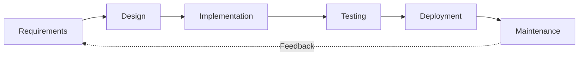

<!-- class: lead -->

# AI Native Dev: Week 2

 

**Adrián Catalan**
adriancatalan@galileo.edu

---

# TraveLens

TraveLens is an **AI-powered travel planning application** built with Next.js 16. It combines dynamic imagery from Unsplash with intelligent itineraries generated by Google Gemini to create a premium travel planning experience.

- **Visual Discovery**: Masonry grid layout.
- **AI Travel Plans**: 3-day itineraries generated by Gemini 3 Flash.
- **Modern UI/UX**: Glassmorphism and "Premium" aesthetic.

---

# TraveLens Demo

---

# What is the SDLC?

**Software Development Life Cycle**

It is the structured process used to design, develop, and test high-quality software. It provides the "Blueprint" for the entire project life.

**Core Phases:**
1.  **Requirement Analysis**: What do we want to build?
2.  **Design**: How will we build it? (Architecture, UI/UX).
3.  **Implementation**: Coding.
4.  **Testing**: Verification and Validation.
5.  **Deployment & Maintenance**: Releasing to the world.

---

# The SDLC Visualized

*   **Traditional Dev**: Spends 70% of time in **Implementation**.
*   **AI-Native Dev**: Spends 70% of time in **Requirements** (Prompting) and **Testing** (Reviewing).

---

# The Implementation Gap

In Week 1, we saw that AI can write code. But **Context Management** is the real challenge.

**What is an Agent?**
An autonomous entity that perceives its environment and acts upon it to achieve a goal.

**What is a Coding Agent?**
An AI specialized in reading codebases, understanding syntax, and generating valid code execution based on specific technical constraints.

---

# Basics on SDLC and Roles

**The Shift**

In an AI-Native team, you are not just a contributor; you are the **Manager**. You define the roles that the AI agents will play.

We identified **8 Distinct Roles** to build TraveLens. Breaking the monolith prevents "Context Drift" (when the AI forgets instructions because the prompt is too long).

---

# Role 1: System Architect 

**Standard Industry Responsibility**:
The Architect makes high-level design choices and dictates technical standards. They don't write the UI; they decide *which UI library* to use.

**AI Agent Responsibility**:
*   Sets up the `package.json`.
*   Defines the directory structure (`src/services`, `src/components`).
*   Establishes patterns (BFF, Repository Pattern).

---

# SDLC Role 1: System Architect

> **System Architect Prompt**
> - Use **context7** to fetch the latest documentation for **Next.js v16+**.
> - Initialize the project and install `shadcn/ui`.
> - **Architectural Requirements:**
>   - **BFF Pattern:** Implement `src/app/api/` for secure routes.
>   - **Services Layer:** Create `src/services/` for core logic.
>   - **Component Hierarchy:** Separate `ui` from `features`.

---

# Role 2: UI/UX Frontend Developer

**Standard Industry Responsibility**:
Translates Figma designs into code. Focuses on accessibility, responsiveness, and visual fidelity.

**AI Agent Responsibility**:
*   Builds components using the *Architect's* specified library (`shadcn`).
*   Implements layouts (Grids, Flexbox).
*   **Constraint**: Must NOT implement backend logic. Mock data only.

---

# SDLC Role 2: Frontend Developer

> **UI/UX Frontend Developer Prompt**
> - Build the interface in **Spanish** using **shadcn/ui**.
> - **Homepage:** Responsive Masonry Grid using Tailwind `columns`.
> - **Detail View:**
>   - **Left Panel:** High-res photo with clean overlay.
>   - **Far-right Sidebar:** "Similar Destinations" as a **Bento Grid**.
> - **Constraints:** Use `urls.small` for performance.

---

# Role 3: Backend Developer 

**Standard Industry Responsibility**:
Handles data processing, database interactions, and API integrations.

**AI Agent Responsibility**:
*   Implements the Interface defined by the Frontend (e.g., `Destination` type).
*   Connects to 3rd party APIs (Unsplash).
*   Ensures data security (BFF Pattern).

---

# SDLC Role 3: Backend Developer

> **Backend Developer Prompt**
> - Implement **Unsplash API** in `src/services/unsplash.ts`.
> - **Logic:**
>   - `fetchPopular()`: Randomized selection of top cities.
>   - `fetchRelated(location, tags)`: Search logic with fallbacks.
> - **Data Mapping:**
>   - Ensure `title` never contains IDs.
>   - Map `urls.thumb`, `small`, and `regular`.

---

# Role 4: Data Specialist 

**Standard Industry Responsibility**:
Often a Data Scientist or AI Engineer. Manages model selection, prompting strategies, and data schema validation.

**AI Agent Responsibility**:
*   Manages the Gemini API connection.
*   Writes the *System Prompt* that the App sends to Gemini.
*   Enforces JSON Schema validation.

---

# SDLC Role 4: Data Specialist

> **Data Specialist (AI Integration) Prompt**
> - **Service:** Implement `src/services/gemini.ts`.
> - **Model:** Use `gemini-3-flash-preview` for speed.
> - **Function:** `generateTravelPlan()` returning **Structured JSON**.
> - **Frontend:** Create `TravelPlanPanel.tsx` to render the JSON output.

---

# Role 5: QA & Code Reviewer

**Standard Industry Responsibility**:
Ensures quality before release. Looks for bugs, accessibility issues, and performance regressions.

**AI Agent Responsibility**:
*   Scans generated code for "AI Hallucinations" (e.g., importing non-existent libs).
*   Checks for Hydration Errors (Next.js specific).
*   Adds educational comments.

---

# SDLC Role 5: QA & Code Reviewer

> **QA & Code Reviewer Prompt**
> - Audit the code from previous roles.
> - **Requirements:** Check for hydration errors, accessibility (ARIA), and API error handling.
> - **Pedagogical Note:** Add comments titled 'REVIEWER_NOTE' to explain complex sections.

---

# Role 6: API Explanation 

**Standard Industry Responsibility**:
Senior Devs document the "Why" and "How" for junior devs.

**AI Agent Responsibility**:
*   Reads the final code.
*   Synthesizes a "How it works" summary.
*   Explains complex logic (e.g., the Unsplash <-> Gemini sync).

---

# SDLC Role 6: API Explanation

> **API Connection Explanation Prompt**
> - Analyze `src/services/unsplash.ts` and `src/services/gemini.ts`.
> - Provide a detailed explanation of:
>   - How the connection with Unsplash API and Gemini API is established.
>   - The logic used to synchronize external images with Gemini-generated plans.

---

# Roles 7 & 8: Documentation & Media

**Standard Industry Responsibility**:
Technical Writers and QAs create proof-of-work and maintenance docs.

**AI Agent Responsibilities**:
*   **Role 7**: Runs the app and captures screenshots (Automation).
*   **Role 8**: Compiles `README.md` using the assets from Role 7.

*Note: In our prompt, these handle the final "Handoff" package.*

---

# Topic 2: Agent Workflows

**The Hand-off Mechanism**

The critical part of an Agentic Workflow is not the *Agent*, but the **Hand-off**. How does information flow from Agent A to Agent B without loss?

**Context Passing Strategy**:
1.  **File Based**: Agent A writes to `src/`. Agent B reads `src/`.
2.  **Interface Based**: Architect defines `interfaces`. Frontend implements `UI`. Backend implements `Data`. Both adhere to the Architect's Interface.

---

# Workflow: Architect -> Frontend

**The Foundation Hand-off**

*   **Input**: Empty Folder.
*   **Agent**: Architect.
*   **Output**: `package.json`, `tsconfig.json`, Folder Structure.

**Why is this hand-off critical?**
If the Architect fails to install `shadcn/ui`, the Frontend agent will fail when asked to "Use shadcn Input". The Frontend *depends* on the Architect's output as its "Truth".

---

# Workflow: Frontend -> Backend

**The "Mock" Hand-off**

*   **Input**: UI Components with hardcoded/mock data.
*   **Agent**: Backend.
*   **Output**: Real API Services replacing mocks.

**The Danger Zone**:
The Backend agent must not *change* the UI structure. It should only *wire up* the data. We explicitly prompt: "Implement the service to match the existing UI props."

---

# Workflow: Backend -> Data Specialist

**The "Intelligence" Hand-off**

*   **Input**: A working data layer (Unsplash).
*   **Agent**: Data Specialist.
*   **Output**: AI Generation Service (`gemini.ts`).

**Why separate?**
Prompting Gemini for a travel plan is a *content* task. Fetching images is a *data* task. By separating them, we verify the Image API works *before* debugging why the AI is generating bad text.

---

# Topic 3: UI Improvements

**Theory: What makes a UI "Premium"?**

1.  **Visual Hierarchy**: The eye should be guided. Large images first, bold titles second, metadata last.
2.  **Gestalt Principles**:
    *   *Proximity*: Related items (Title + City) stay close.
    *   *Common Region*: The Card container groups content.
3.  **Feedback Loops**: Every interaction (Hover, Click) must have an immediate visual response (Scale, Opacity change).

---

# Why Gemini?

**The Need for Speed**

In TraveLens, we use `gemini-3-flash-preview`.

*   **Latency**: < 1000ms.
*   **Context**: 1 Million tokens (allows us to pass huge context if needed).
*   **Cost**: Significantly cheaper than Pro models.

**Use Case**:
When a user clicks "Generate Plan," they expect an instant result. We trade the *reasoning depth* of Pro models for the *instant feedback* of Flash models.

---

# Weekly Project: UI/UX Refinement

**Goal**: The current app is functional. Your job is to make it delightful.

**Definition of Done**:
- [ ] **Interaction**: Add "View Transitions" so images morph when clicking a card.
- [ ] **Feature**: Implement a "Save to Favorites" button using `localStorage` (Persist state).
- [ ] **Visuals**: Add a "Dark Mode" toggle that actually looks good (Theme aware).
- [ ] **Deep Link**: Add a "Share" button that copies a URL with current params.
- [ ] **Polish**: Replace `alert()` with specific UI Toasts (use `sonner` or `toast`).

---

# Resources

**Reading & Learning**

*   [The AI-Native Developer: A manifest](https://www.swyx.io/ai-native-dev) - *Swyx.*
*   [Components as Data: The future of UI](https://rauchg.com/2023/ai-components) - *Guillermo Rauch.*
*   [Gestalt Principles in UI Design](https://www.usertesting.com/blog/gestalt-principles) - *Theory.*
*   [Micro-Interactions: Why details matter](https://www.nngroup.com/articles/microinteractions/) - *NN/g.*
*   [Google Gemini Models](https://ai.google.dev/models) - *Understanding Flash vs Pro.*

---

# Advanced Resources

**Deep Technical Reads**

*   [Patterns for Building LLM-based Systems & Products](https://eugeneyan.com/writing/llm-patterns/) - *Eugene Yan.*
*   [Building LLM Applications for Production](https://huyenchip.com/2023/04/11/llm-engineering.html) - *Chip Huyen.*
*   [Strategies for rigorous agentic workflows](https://www.anthropic.com/research/building-effective-agents) - *Anthropic Research.*
*   [Generative UI & Vercel AI SDK](https://vercel.com/blog/ai-sdk-3-generative-ui) - *Concept deep dive.*

