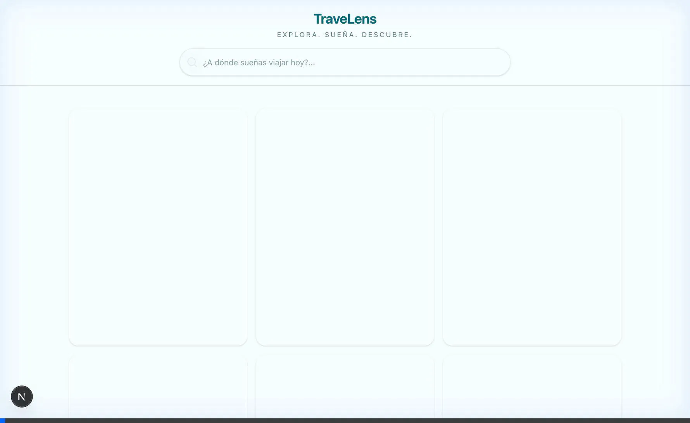
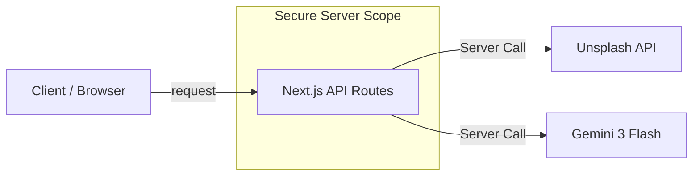
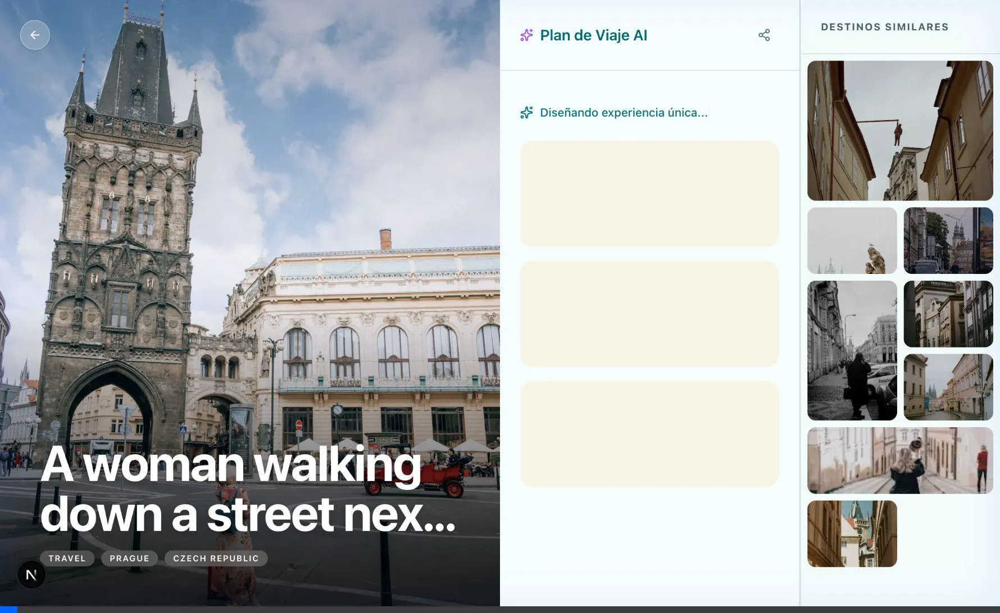

# TraveLens

TraveLens is an AI-powered travel planning application built with Next.js 16. It combines dynamic imagery from Unsplash with intelligent itineraries generated by Google Gemini to create a premium travel planning experience.



## Features

- **Visual Discovery**: High-quality imagery from Unsplash with a masonry grid layout.
- **AI Travel Plans**: Integration with Google Gemini (`gemini-3-flash-preview`) to generate 3-day itineraries, hidden gems, and local food recommendations.
- **Modern UI/UX**: Built with `shadcn/ui` and Tailwind CSS v4, featuring glassmorphism and smooth transitions.
- **Native Sharing**: Uses the Web Share API to easily share travel plans.

## Role-Based Contribution

This project was developed simulating a collaborative team environment:

1.  **System Architect**: Established the project structure and API layers.
2.  **Backend Developer**: Implemented the Unsplash Services and robust search logic.
3.  **UI/UX Developer**: Designed the "Premium Travel" aesthetic, focusing on visual hierarchy and interactions.
4.  **Data Specialist**: Integrated the Gemini 3 Flash model with strict JSON schema outputs.
5.  **QA Engineer**: Validated flows and fixed critical bugs (Share/Similar Destinations).
6.  **Documentation Specialist**: Created this technical documentation and architectural references.

## UI/UX Design Philosophy

The interface was designed to inspire "wanderlust" through:
- **Visual Dominance**: Use of large, high-resolution images as the primary content driver.
- **Clean Typography**: Utilizing `Geist` and `Inter` for readability.
- **Interactive Elements**: Micro-interactions on hover (cards, buttons) to make the app feel alive.
- **Glassmorphism**: Subtle translucent layers to overlay text on images without obscuring them.

## Technical Architecture

TraveLens uses **Next.js API Routes** to secure keys and abstract third-party complexity. This ensures a secure server-side environment for API interactions.



### API Routes
- **GET /api/search**: Proxies Unsplash requests, creating a custom `Destination` object.
- **POST /api/ai-plan**: secure gateway to Google Gemini, enforcing JSON output.

## Tech Stack

- **Framework**: Next.js 16.1.0 (App Router, Turbopack)
- **Language**: TypeScript
- **Styling**: Tailwind CSS v4, shadcn/ui (Radix Primitives)
- **AI Model**: Google Gemini 3 Flash Preview
- **Data**: Unsplash API
- **Icons**: Lucide React

## Getting Started

### Prerequisites

- Node.js 18+
- Unsplash Developer Access Key
- Google Cloud Gemini API Key

### Installation

1. Clone the repository:
   ```bash
   git clone https://github.com/your-username/travelens.git
   ```

2. Install dependencies:
   ```bash
   npm install
   ```

3. Create a `.env.local` file:
   ```env
   UNSPLASH_ACCESS_KEY=your_key_here
   GOOGLE_GENAI_API_KEY=your_key_here
   ```

4. Run the development server:
   ```bash
   npm run dev
   ```

   Visit `http://localhost:3000` to usage.


