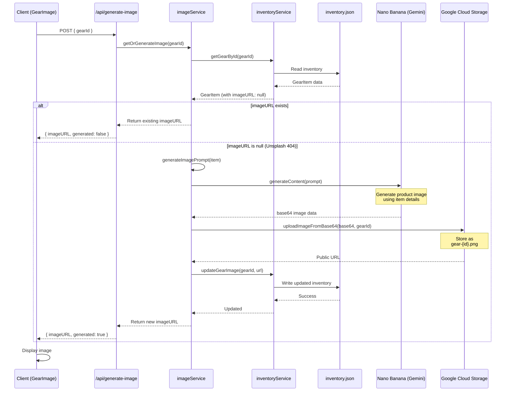
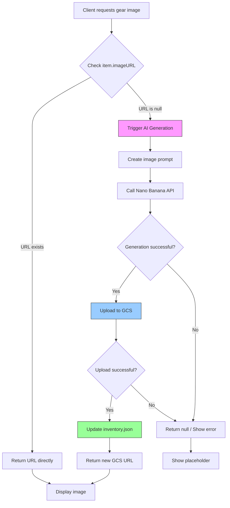
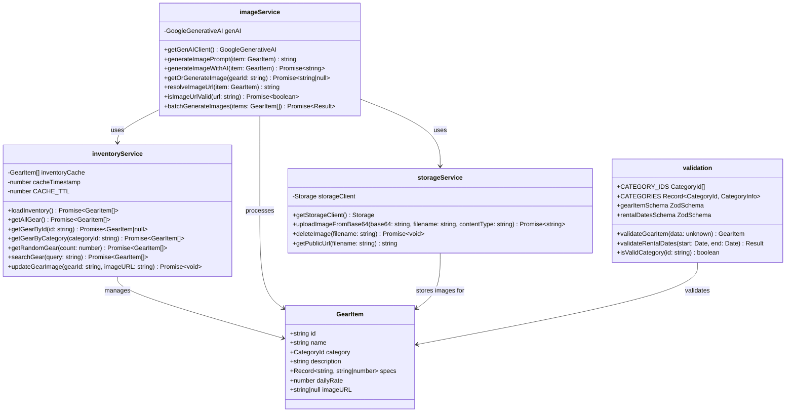
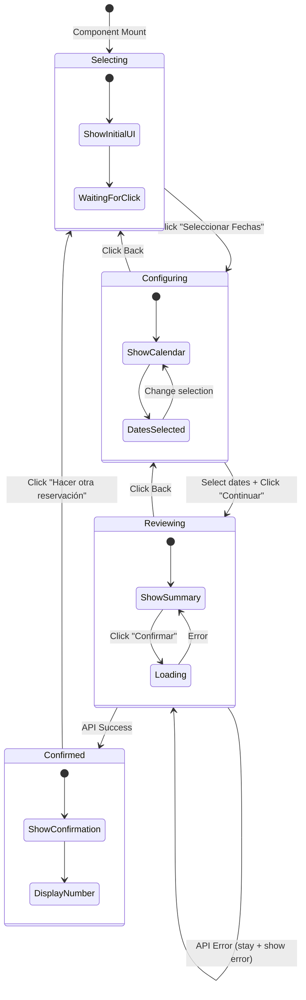
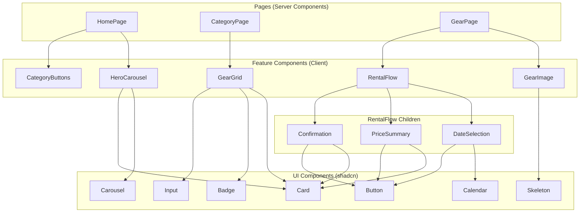
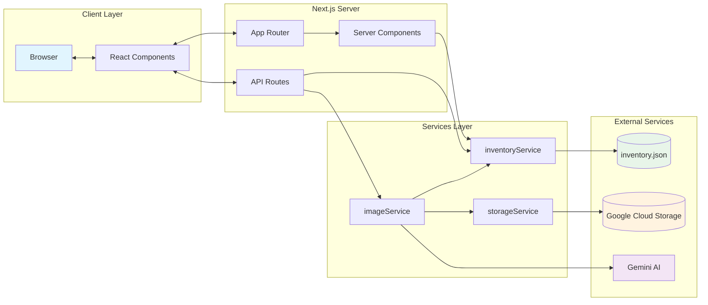
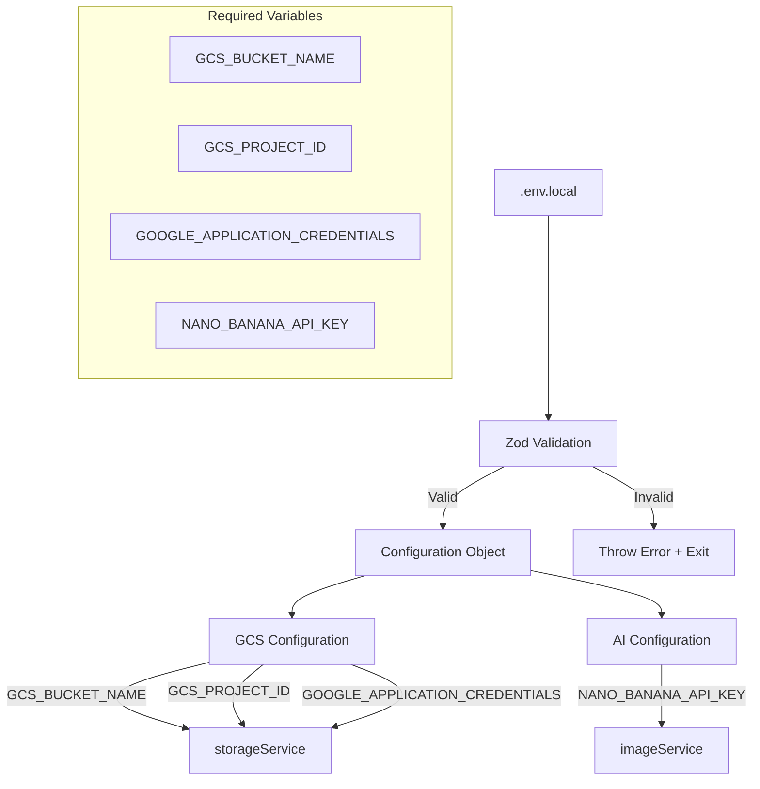

# System Diagrams

## Image Resolution Flow

This sequence diagram shows the complete flow from checking the JSON inventory file, through Nano Banana AI generation, to GCS persistence.

## Image Resolution Decision Tree

## Service Class Diagram

This diagram shows the interactions between `inventoryService` and `imageService`.

## Rental Flow State Machine

## Component Hierarchy

## Data Flow Diagram

## Environment Configuration Flow

