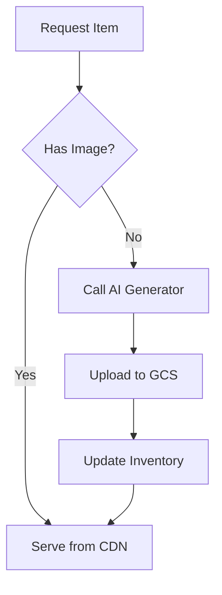

<!-- _class: lead -->

# AI Native Dev
## Week 3
### Adrián Catalan
adriancatalan@galileo.edu

---

<!-- _class: lead -->

# Rent My Gear
## Premium Equipment Marketplace

---

# The Application

"Rent My Gear" is a Next.js 16+ application for renting photography, camping, and water sports equipment.

*   **Stack**: Next.js (App Router), Tailwind CSS, Shadcn UI.
*   **AI Integration**: "Nano Banana" (Gemini) for on-demand image generation.
*   **Storage**: Google Cloud Storage (GCS) for asset persistence.
*   **Problem**: It works... mostly. It has hidden bugs, missing tests, and zero documentation.

---

<!-- _class: lead -->

# Topic 1: Debugging
## The AI as Sherlock Holmes

---

# The "Fix-It" Loop

When debugging with AI, we don't just paste code and say "fix it". We use a structured approach:

1.  **Context Injection**: Provide the error logs + relevant file contents.
2.  **Hypothesis Generation**: Ask the AI to list 3 possible causes (Logic, State, Validation).
3.  **Step-by-Step Resolution**: Fix one layer at a time.

> "A bug is just an undeclared feature... until it costs money."

---

# Example: Guided Debugging Prompt

We intentionally injected bugs (off-by-one errors, Zod validation issues). Here is how we ask the Agent to solve them:

> **Guided Debugging**: "Users are reporting that the total price for rentals is lower than expected...
> 1. Run the application and inspect logs.
> 2. Analyze `src/lib/date-utils.ts` and Zod schemas.
> 3. Identify logical errors and propose fixes."

*This creates a plan before touching code.*

---

<!-- _class: lead -->

# Topic 2: Testing
## Trust, but Verify

---

# AI-Driven TDD

Writing tests is tedious. AI loves tedious work.
We use **Vitest** and **React Testing Library** to create a safety net.

*   **Unit Tests**: Validate pure functions (e.g., Price Calculation).
*   **Integration Tests**: Simulate user flows (e.g., Clicking "Rent").
*   **Edge Cases**: What happens if the Image API returns 404?

---

# Example: Generating a Test Suite

Instead of writing `expect(true).toBe(true)`, detailed prompting gives us full coverage:

> **Testing Suite**: "Using Vitest... generate a testing suite:
> 1. **Unit Tests:** `date-utils.ts` with various ranges.
> 2. **Integration:** Full rental flow (Success toast).
> 3. **Edge Cases:** Handle Nano Banana fallback on 404."

*Result: A comprehensive `date-utils.test.ts` with Leap Year support.*

---

<!-- _class: lead -->

# Topic 3: Documentation
## Code is Temporary, Docs are Forever

---

# The "Bus Factor"

If you leave the project tomorrow, can someone else run it?
AI Agents excel at creating structure from chaos.

**Key Documents**:
1.  **ONBOARDING.md**: How to start (Environment, Install, Run).
2.  **ARCHITECTURE.md**: System design (Presentation vs Data Layers).
3.  **DIAGRAMS.md**: Visual flows (Mermaid.js).

---

# Example: Architecture Documentation

We ask the Agent to reverse-engineer our code into a clear diagram:

> **Documentation**: "Create a **Mermaid sequence diagram** showing the 'Image Resolution Flow' (JSON -> Nano Banana -> GCS Persistence). Also write an 'Onboarding Guide' explaining code and architecture."

*This generates the artifacts found in `docs/`.*

---

<!-- _class: lead -->

# Deep Dive
## Architectural Insights

---

# 1. The "Nano Banana" Trap (Hallucinations)

We asked the Agent to install "Nano Banana Pro Local SDK".
**It doesn't exist.** But the Agent might try to `npm install nano-banana-sdk` or hallucinate configuration code.

*   **Lesson**: Always verify libraries.
*   **Rule**: If an Agent suggests a library you've never heard of for a complex task, check NPM first.

---

# 2. Separation of Concerns

Our project structure follows a strict hierarchy to make AI editing safer:

```
src/
├── components/features/  # UI Logic (Client)
├── services/            # Business Logic (Server/Client agnostic)
└── lib/                 # Pure Utility Functions
```

*   **Why?**: You can ask the AI to "Refactor the validaton in `lib/`" without breaking the UI components in `components/`.

---

# 3. Smart Image Strategy

A Hybrid approach to assets:



*   **Benefit**: Saves costs (only generate once) and latency (serve static).

---

<!-- _class: lead -->

# Weekly Project
## Guarantee Reliability

---

# The Challenge: Fix & Fortify

**Objective**: The app has 3 critical bugs and zero tests. Fix them and prove it.

**Definition of Done**:
- [ ] **Fix Logic Error**: `date-utils.ts` calculates exact day range (fix off-by-one).
- [ ] **Fix Validation**: Zod schema allows rentals > 7 days.
- [ ] **Fix State**: `RentalFlow` button stops loading after error/success.
- [ ] **Test Coverage**: > 80% coverage on `date-utils` and `RentalFlow`.
- [ ] **Docs**: Complete `ONBOARDING.md` and `DIAGRAMS.md` (Mermaid).

---

# Resources

**Testing Tools**
*   [Vitest Documentation](https://vitest.dev/)
*   [React Testing Library Cheatsheet](https://testing-library.com/docs/react-testing-library/cheatsheet)

**Architecture & Cloud**
*   [Google Cloud Storage Node.js Client](https://cloud.google.com/nodejs/docs/reference/storage/latest)
*   [Mermaid.js Live Editor](https://mermaid.live/)

**AI Concepts**
*   [Hallucinations in LLMs (Google Cloud)](https://cloud.google.com/discover/what-are-ai-hallucinations)
