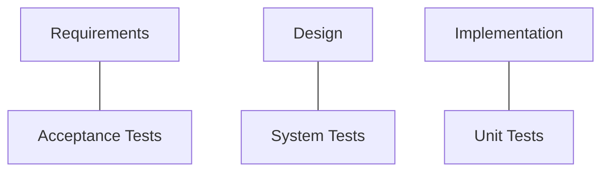
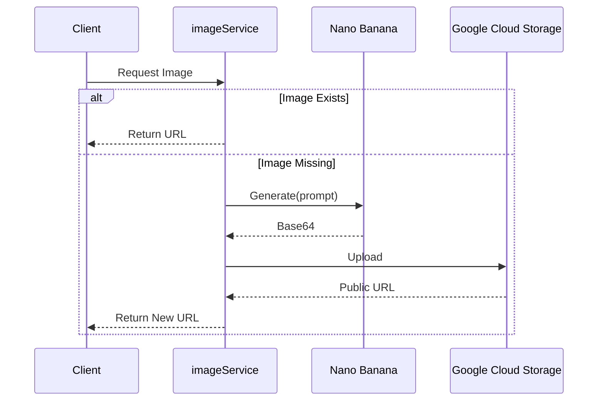
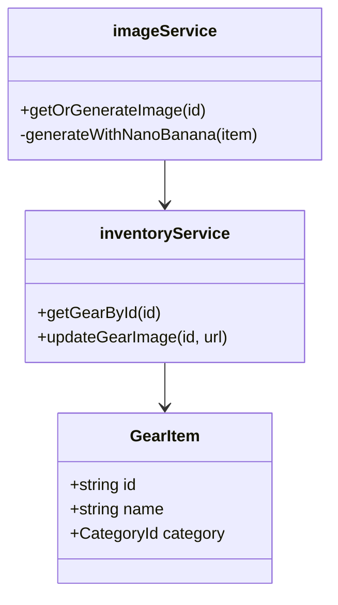
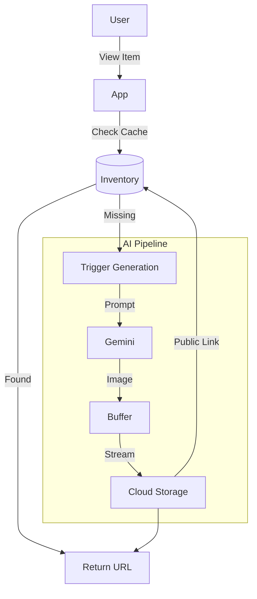

<!-- _class: lead -->

# AI Native Dev
## Week 3
### Adrián Catalan
adriancatalan@galileo.edu

---

<!-- _class: lead -->

# Rent My Gear
## Premium Equipment Marketplace

---

# The Application

"Rent My Gear" is a Next.js 16+ application for renting photography, camping, and water sports equipment.

*   **Stack**: Next.js (App Router), Tailwind CSS, Shadcn UI.
*   **AI Integration**: "Nano Banana" (Gemini) for on-demand image generation.
*   **Problem**: It works... mostly. But it has hidden bugs, missing tests, and zero documentation.

---

# Rent My Gear: Visual Discovery


---

# Rent My Gear: Rental Flow


---

<!-- _class: lead -->

# Topic 1: Debugging
## The AI as Sherlock Holmes

---

# 1. Why do we need Structured Debugging?

**The "Spray and Pray" Problem**
In traditional development, when a bug appears, we stare at `console.log` for hours.

*   **Cost**: Average developer spends 50% of their time debugging.
*   **Risk**: Fixing one bug often creates two more ("Whac-A-Mole").

**The AI Advantage**
An Agent can analyze the *Logic*, the *State*, and the *Semantics* simultaneously.

---

# 2. Traditional vs AI-Native Debugging

| Feature | Traditional Debugging | AI-Native Debugging |
| :--- | :--- | :--- |
| **Input** | `console.log("here")` | Error Trace + File Context |
| **Analysis** | Manual Stack Trace Reading | Pattern Matching + Semantic Analysis |
| **Hypothesis** | Developer Intuition | Multi-Factor Probability Assessment |
| **Fix** | Trial and Error | Step-by-Step Resolution Plan |

---

# 3. Method: The "Context Injection" Loop

We don't just dump the error. We use a **Loop**:

1.  **Context Injection**: Provide the error logs + relevant file contents.
2.  **Hypothesis Generation**: Ask the AI to list 3 possible causes (Logic, State, Validation).
3.  **Step-by-Step Resolution**: Fix one layer at a time.
4.  **Verify**: Run the code to check if the error persists.

---

# 4. Prompt: Error Injection

To learn, we first break things. We ask the AI to **inject** subtle bugs.

> **Prompt**: "Modify the current codebase of **Rent my Gear** to introduce the following three subtle bugs for educational purposes:
> 1. **Logic Error:** In `src/lib/date-utils.ts`, modify the price calculation so it misses the final day (off-by-one).
> 2. **Validation Error:** In Zod schema, reject rentals > 7 days.
> 3. **State Error:** Make 'Confirmar' button stick in 'loading' state."

---

# 5. Anatomy of the Logic Bug (Code)

The AI modifies `date-utils.ts` to be *almost* correct.

```typescript
// src/lib/date-utils.ts (BUGGY VERSION)
export function calculateRentalDays(startDate: Date, endDate: Date): number {
  const days = differenceInDays(startDate, endDate);
  // ERROR: Missing the +1 inclusive day
  return Math.abs(days);
}
```

*   **Impact**: User rents Mon-Tue (2 days). System charges for 1 day.
*   **Business Cost**: 50% revenue loss on short rentals.

---

# 6. Prompt: Guided Debugging

Now we switch roles. We are the Senior Dev guiding the Agent to fix it.

> **Prompt**: "Users are reporting that the total price for rentals is lower than expected...
> 1. Run the application and inspect the terminal and browser logs.
> 2. Analyze `src/lib/date-utils.ts` and the Zod validation schemas.
> 3. Identify the logical errors and propose fixes."

---

# 7. Prompt: Fixing "Invisible" Errors

Some bugs are subtle, like Hydration Mismatches in Next.js.

> **Prompt**: "The UI 'flickers' or shows different content than the server-rendered HTML. Why does this happens? Investigate components that render dynamic content on the home page.
>
> *Note: If the AI suggests it is a CSS issue, insist on checking the React rendering cycle and values used in initial state (useState).*"

---

# 8. Key Takeaway: Debugging

> **Don't ask "Fix this Error".**
> **Ask "Explain why this state is reached".**

*   **Rule**: Always force the AI to explain the root cause (Hypothesis) before generating the code fix.
*   **Benefit**: You learn the system while the AI fixes it.

---

<!-- _class: lead -->

# Topic 2: Testing
## Trust, but Verify

---

# 1. Test Driven Development (TDD)

**The Concept**
Reverse the workflow. Write the *Requirement* as a *Test* before you write the *Code*.

**The Cycle (Red-Green-Refactor)**:
1.  **Red**: Write a test that fails (because the feature doesn't exist).
2.  **Green**: Write just enough code to pass the test.
3.  **Refactor**: Clean up the code while keeping the test green.

---

# 2. Why TDD is hard (Traditionally)

1.  **Boilerplate**: Setting up mocks and imports takes longer than writing the function.
2.  **Mental Shift**: It's hard to test something that doesn't exist yet.
3.  **Maintenance**: Tests can be brittle and break with minor changes.

**AI Solves This**: It generates the boilerplate and the "Red" state instantly based on your spec.

---

# 3. AI-Driven TDD Strategy

We treat Testing as the mirror of Implementation.



With AI, we generate the **Right Side** (Tests) often *before* or *immediately after* the **Left Side** (Code).

---

# 4. Prompt: Generating a Test Suite

We design the *scope*.

> **Prompt**: "Using **Vitest** and **React Testing Library**, generate a testing suite for the rental module:
> 1. **Unit Tests:** Create tests for `src/lib/date-utils.ts` to validate price calculations...
> 2. **Integration Tests:** Simulate the full rental flow: selecting a category, picking a gear item...
> 3. **Edge Cases:** Test how the system handles the 'Nano Banana' fallback if the Unsplash API returns a 404 error."

---

# 5. Example: Deep Verification

 The AI generates exhaustive test cases, including edge cases like Leap Years.

```typescript
// Generated: src/lib/date-utils.test.ts
describe("calculateRentalDays", () => {
  it("should calculate correct days for leap year crossing", () => {
    const start = new Date("2024-02-28");
    const end = new Date("2024-03-01");
    // 2024 is leap year: Feb 28, Feb 29, Mar 1 = 3 days
    expect(calculateRentalDays(start, end)).toBe(3);
  });
});
```

---

# 6. Integration Testing with AI

Testing React Components requires mocking context and API.

```typescript
// Generated: mocks/handlers.ts
import { http, HttpResponse } from 'msw'

export const handlers = [
  http.get('/api/gear', () => {
    return HttpResponse.json(mockInventory)
  }),
  http.post('/api/rental', () => {
    return HttpResponse.json({ success: true, id: "RENT-123" })
  })
]
```

---

# 7. Edge Cases & Resilience

What happens when 3rd party APIs fail?

*   **Scenario**: Unsplash API goes down (500 Error).
*   **Test**: Ensure `imageService` switches to "Nano Banana" fallback seamlessly.
*   **Prompt Segment**: *"Test how the system handles the 'Nano Banana' fallback if the Unsplash API returns a 404 error."*

---

# 8. Key Takeaway: Testing

> **AI turns Testing from a "chore" into a "spec".**

*   **Workflow**: Write Code -> Prompt for Tests -> Fix Code based on Test Failures.
*   **Benefit**: You get a robust safety net for free.

---

<!-- _class: lead -->

# Topic 3: Documentation
## Code is Temporary, Docs are Forever

---

# 1. The "Bus Factor"

**Bus Factor**: The number of team members that can get "hit by a bus" before the project stalls.
*   **Low Factor (1)**: Only YOU know how the build works.
*   **High Factor**: Anyone can read `ONBOARDING.md` and deploy.

**Documentation is the ultimate scalability tool.**

---

# 2. Types of AI Documentation

1.  **Narrative**: "How-to" guides (Onboarding).
2.  **Structural**: Diagrams (Mermaid.js).
3.  **Reference**: API Docs (Swagger/OpenAPI).
4.  **Inline**: JSDoc comments for complex logic.

---

# 3. Method: Reverse Engineering

We ask the Agent to read our code and explain it back to us visually.

*   **Constraint**: The Agent must read the `src/` folder to know the truth.
*   **Output**: Standardized Markdown formats.

---

# 4. Prompt: Documentation Generation

> **Prompt**: "Generate full technical documentation for **Rent my Gear**:
> 1. Document everything that's needed for project understanding.
> 2. Create a **Mermaid sequence diagram** showing the 'Image Resolution Flow' (JSON file -> Nano Banana -> GCS Persistence).
> 3. Create a **Mermaid class diagram** for the `inventoryService` and `imageService` interactions."

---

# 5. Diagram: Image Resolution Flow

The AI visualizes the logic we built in Week 2.



---

# 6. Diagram: Class Hierarchy

Visualizing the service layer to ensure separation of concerns.



---

# 7. The "Onboarding" Artifact

The `docs/ONBOARDING.md` file is crucial for new hires (or AI Agents).

**Prompt**:
> "Write an 'Onboarding Guide' that explains code, architecture, all that's needed for a new developer to join the project, how to debug the GCS connection..."

*The AI writes this by scanning `package.json`, `.env.example`, and file structure.*

---

# 8. Key Takeaway: System Memory

> **Documentation is the Long-Term Memory of your Team.**

*   **Rule**: Never merge a PR without updating the relevant `docs/` file.
*   **AI Role**: Use the "Documentation Role" to auto-generate the diff.

---

<!-- _class: lead -->

# Deep Dive
## Architectural Insights

---

# 1. The "Nano Banana" Trap (Hallucinations)

We asked the Agent to install **"Nano Banana Pro Local SDK"**.

*   **The Reality**: It doesn't exist. "Nano Banana" is a made-up name.
*   **The Risk**: The Agent might give you `npm install nano-banana-sdk`.
*   **The Lesson**: Agents hallucinate to satisfy requirements.

---

# 2. Prompt: Hallucination Demo

We intentionally try to trick the AI to see if it catches the lie.

> **Prompt**: "We want to integrate the **Nano Banana Pro Local-Offline SDK for Next.js 16** to process images directly on the user's GPU without using API calls. Do not change the project yet, but provide the exact npm command to install this local SDK, configuration and show the code needed for the `offline-gen` mode."

*Will it invent a library? Or will it tell you it doesn't exist?*

---

# 3. Code Spotlight: The "Fake" Implementation

If the Agent hallucinates, it might look like this:

```javascript
// WARNING: THIS IS HALLUCINATED CODE
import { NanoBanana } from '@nano-banana/sdk';

const nb = new NanoBanana({
  gpu: true, // "GPU Acceleration"
  mode: 'offline'
});

export function generate() {
  return nb.dream('kayak'); // "Dream" method doesn't exist
}
```

*Always cross-reference obscure libraries with `npm search`.*

---

# 4. Real Architecture: Image Strategy

A valid Hybrid Strategy using Server Actions and Cloud Storage.



---

<!-- _class: lead -->

# Weekly Project
## Feature Expansion with TDD

---

# The Challenge: "Smart Insurance"

**Context**: Users are damaging premium gears. We need an optional "Damage Protection" add-on.

**The Task**:
Implement a **Dynamic Insurance** feature that calculates a fee based on the category:
*   **Photography/Video**: 20% of daily rate (High Risk).
*   **All other categories**: 10% of daily rate.

**The Constraint**:
You must use **AI-Driven TDD**. You cannot write the implementation until the AI has generated a failing test suite.

---

# Definition of Done

- [ ] **100% Base Coverage**: Ensure existing demo app tests pass with 100% coverage.
- [ ] **Feature TDD**: Implement "Smart Insurance" maintaining 100% coverage.
- [ ] **Documentation**: Update `docs/DIAGRAMS.md`, `docs/ONBOARDING.md`, and `README.md`.
- [ ] **Verification**: Submit proof of 100% coverage from `npm run test:coverage`.

---

<!-- _class: lead -->

# Resources
## Deep Dive Material

---

# Resources: Debugging & Agents

*   **[The Debugging Decay Index (2025)](https://arxiv.org/abs/2405.08775)** - Why AI struggles with long debugging sessions.
*   **[Debugging with LLMs: A Benchmark (DebugEval)](https://arxiv.org/abs/2401.04620)** - Research on how LLMs perform on Python/C++ bugs.
*   **[Systematic Debugging with AI Agents](https://engineering.atspotify.com/2023/12/how-we-use-ai-for-debugging-at-spotify/)** - Real-world patterns from Spotify usage.
*   **[The Art of Error Injection](https://microsoft.github.io/code-with-engineering-playbook/automated-testing/error-injection/)** - Microsoft Engineering Playbook on learning through breakage.
*   **[Prompt Engineering for Debugging](https://www.promptingguide.ai/applications/coding)** - Techniques to force "Reasoning Trace" before "Code Fix".

---

# Resources: Testing Strategy

*   **[Rethinking Test Efficiency with AI](https://martinfowler.com/articles/2023-test-automation-ai.html)** - Martin Fowler's blog on effective AI testing.
*   **[React Testing Library: Common Mistakes](https://kentcdodds.com/blog/common-mistakes-with-react-testing-library)** - Kent C. Dodds (Creator) on what NOT to do.
*   **[Vitest vs Jest: A Performance Comparison](https://vitest.dev/guide/comparison.html)** - Why we chose Vitest for the modern stack.
*   **[TDD with GitHub Copilot](https://github.blog/2023-08-30-how-to-use-github-copilot-for-test-driven-development/)** - Official guide on the "Test-First" workflow with AI.
*   **[The V-Model in the Age of AI](https://towardsdatascience.com/the-v-model-for-ai-projects-9f892551525d)** - Adapting traditional verification models to generative AI.

---

# Resources: Documentation & Knowledge

*   **[Docs as Code: A Comprehensive Guide](https://www.writethedocs.org/guide/docs-as-code/)** - The industry standard philosophy we follow.
*   **[The "Bus Factor" and Technical Debt](https://understandlegacycode.com/blog/what-is-the-bus-factor/)** - Why documentation is an asset, not a chore.
*   **[Mermaid.js for Developers](https://mermaid.js.org/intro/getting-started.html)** - Visualizing code without leaving Markdown.
*   **[Technical Debt Records (TDRs)](https://18f.gsa.gov/2015/10/05/managing-technical-debt/)** - 18F's approach to documenting decisions and compromises.
*   **[Google's Style Guide for Developer Documentation](https://developers.google.com/style)** - Gold standard for writing clear technical guides.
