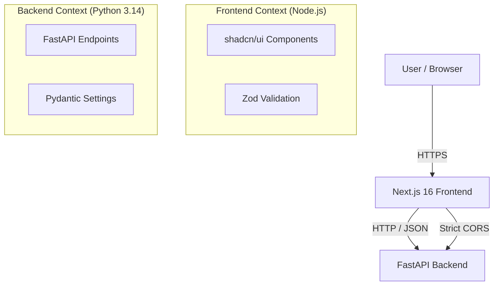

# Decoupled Boilerplate: Next.js 16 + FastAPI (Python 3.14)

A production-grade boilerplate demonstrating a strictly decoupled architecture with a modern frontend and high-performance backend.

## Architecture

The system follows a decoupled "Backend for Frontend" (BFF) style where the Next.js frontend consumes the FastAPI backend.



## Quick Start

For detailed setup instructions, please refer to [ONBOARDING.md](ONBOARDING.md).
For architecture decisions and patterns, see [TECHNICAL_DOCS.md](TECHNICAL_DOCS.md).

### Backend (Python 3.14)

Navigate to `/backend`:

```bash
cd backend
# Create virtual environment
python3.14 -m venv venv
source venv/bin/activate

# Install dependencies
pip install -e ".[test]"

# Run Development Server
uvicorn main:app --reload --port 8000
```

### Frontend (Next.js 16)

Navigate to `/frontend`:

```bash
cd frontend
# Install dependencies
npm install

# Run Development Server
npm run dev
```

Visit `http://localhost:3000` to see the dashboard.

## Testing

- **Backend:** `pytest` (in `/backend`)
- **Frontend:** `npm test` (in `/frontend`)
