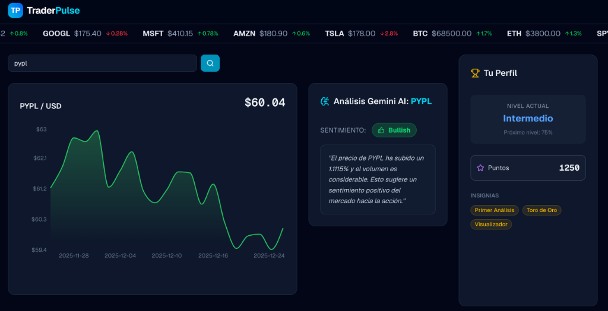

<!-- _class: lead -->

# AI Native Dev
## Week 4
### Adrián Catalan
adriancatalan@galileo.edu

---

<!-- _class: lead -->

# TraderPulse
## Real-Time SaaS Dashboard

---

# The Application

"TraderPulse" is a **Financial SaaS Dashboard** that combines real-time market data with AI-driven sentiment analysis.

*   **Stack**: Next.js 16 (Global Frontend), FastAPI (Python Backend).
*   **Data**: Live stock quotes via Yahoo Finance (`yfinance`).
*   **AI**: Gemini 3 Flash for "Bullish/Bearish" sentiment detection.
*   **Architecture**: Decoupled Monorepo (Frontend + Backend).

---

# TraderPulse Demo



---

<!-- _class: lead -->

# Topic 1: Decoupled Architecture

---

# Why Separate Frontend & Backend?

**The "Monolith" vs "Decoupled"**

*   **Frontend (Next.js)**: Needs "Edge" speed, SEO, and fast iteration. Best on **Vercel**.
*   **Backend (FastAPI)**: Needs raw compute, heavy libraries (Pandas, yfinance), and long-running threads. Best on **Cloud Run**.

**The AI Advantage**:
*   AI Agents thrive on "Separation of Concerns".
*   You can assign one Agent to the "API Contract" and another to the "UI Implementation".

---

# Decoupled Architecture: High Level

Separate concerns, separate scale.

```text
+-----------+      +----------------+      +-------------+
|           |HTTPS |                | App  |   Frontend  |
| User/Conn | ---> |  Vercel Edge   | ---> |  Container  |
|           |      |                |      |             |
+-----------+      +----------------+      +------+------+
                                                  |
                                                  | API Call
                                                  v
                                           +--------------+
                                           |  Cloud Run   |
                                           +-------+------+
                                                   | Validation
                                                   v
                                           +--------------+
                                           |   Pydantic   |
                                           +-------+------+
                                                   | Logic
                                                   v
                                           +--------------+
                                           |   FastAPI    |
                                           +--------------+
```

*   **Frontend**: Handles User State, UI rendering, and SEO.
*   **Backend**: Handles Business Logic, Heavy Compute, and Data Security.

---

# The "Contract First" Approach

How do we keep them in sync? **OpenAPI (Swagger)**.

1.  **Backend Agent**: "Create a FastAPI endpoint `GET /sentiment` returning `{ sentiment: string }`."
2.  **Frontend Agent**: "Read the `openapi.json` from the backend and generate a typed TypeScript client."

*Result: Type-safe integration without the monolith headache.*

---


# Design Pattern: Backend for Frontend (BFF)

In **TraderPulse**, our FastAPI Service is not just a data API, it's a **BFF**.

*   **Aggregator**: It calls Yahoo Finance (Source A) + Gemini AI (Source B).
*   **Transformer**: It merges "Price" + "Sentiment" into a single JSON response for the UI.
*   **Simplifier**: The Frontend makes *one* call to `/api/v1/sentiment`, not multiple calls to external services.

---

# Backend Architecture

**Modern Python for AI (FastAPI + Python 3.12+)**

1.  **Validation First**: `Pydantic Settings` (v2+) reads `.env` and crashes early if configs are missing.
2.  **Security**: Strict CORS Middleware. Only the specific Vercel URL is allowed to talk to us.
3.  **Performance**: Python 3.12+ has significant speed improvements over older versions.

---

# Prompt: Backend Specification

We explicitly ask for these standards to avoid "Hello World" quality code.

> "Create a **FastAPI** backend using **Python 3.12+**.
> * **Environment Validation**: Use **Pydantic Settings** to validate `FRONTEND_URL`.
> * **CORS**: Middleware that strictly allows `FRONTEND_URL`.
> * **DevOps**: `Dockerfile` using `python:3.12-slim` multi-stage build."

---

# Frontend Architecture (Next.js 16)

**Safety at the Edge**

1.  **Runtime Validation**: `Zod` checks environment variables at build time. No more `undefined` API calls.
2.  **Server Components**: Fetch data on the server (close to the DB/API), send HTML to the user.
3.  **Client Components**: Handle the interactive bits (Buttons, Optimistic Updates).

---

# Prompt: Frontend Specification

Directing the Agent on Architecture.

> "**Data Consumption**:
> * Implement a **Server Component** to fetch the `/health` status.
> * Implement a **Client Component** using `shadcn/ui` to display status.
> * **Environment**: Use **Zod** to validate `NEXT_PUBLIC_API_URL`."

---

# Key Takeaway: Decoupled Architecture

Separate stacks allow separate velocities.

*   **Teams**: One team can deploy the Frontend (Vercel) 10 times a day, while the Backend team (Cloud Run) ships weekly stable releases.
*   **Scale**: The Frontend scales on the Edge (globally). The Backend scales on Compute (regionally).
*   **Complexity**: Higher initial setup (CORS, JWT, Git Ops), but infinite scalability.

---

<!-- _class: lead -->

# Topic 2: Deployment

---

# The AI Deployment Paradox

**Traditional DevOps**:
Write Code -> Push -> CI/CD -> Build -> Deploy.
*   *Bottleneck*: Configuration (YAML hell, Secret management).

**AI-Native DevOps**:
Prompt -> Config Generation -> Deploy.
*   *Advantage*: Agents understand the *infrastructure* code (Terraform, Dockerfiles) better than most devs.

---

# Prompt: Dockerizing Python

We need to containerize the FastAPI backend for Cloud Run.

> **Prompt**: "Create an optimized `Dockerfile` for a FastAPI application using Python 3.12-slim.
> 1. Use multi-stage builds to minimize image size.
> 2. Install production dependencies (gunicorn/uvicorn).
> 3. Ensure the container runs as a non-root user for security.
> 4. Expose port 8080."

---

# Example: The Optimized Dockerfile

The agent generates a production-ready Dockerfile.

```dockerfile
# Generated by Agent
FROM python:3.12-slim as builder
WORKDIR /app
COPY requirements.txt .
RUN pip install --no-cache-dir -r requirements.txt

FROM python:3.12-slim
WORKDIR /app
COPY --from=builder /usr/local/lib/python3.12/site-packages /usr/local/lib/python3.12/site-packages
COPY . .
# Security: Run as non-root
RUN useradd -m appuser && chown -R appuser /app
USER appuser
CMD ["uvicorn", "main:app", "--host", "0.0.0.0", "--port", "8080"]
```

---

# Cloud Architecture: Serverless

We use a **Serverless** approach for cost efficiency and scale.

```text
                      +----------+        +-------------+
                      |          | HTTPS  |    Vercel   |
                      |   User   | -----> |  (Frontend) |
                      |          |        |             |
                      +----------+        +------+------+
                                                 |
                                                 | Next.js Proxy
                                                 v
      +--------+          +-------+       +--------------+
      | Gemini | <------- | Cloud | ----> | YahooFinance |
      +--------+    SDK   |  Run  |  Lib  +--------------+
                          +---+---+
                              |
                              | Secrets
                              v
                         +----------+
                         |   GSM    |
                         +----------+
```

*   **Frontend**: Hosted on Edge (Vercel).
*   **Backend**: Hosted on Container (Cloud Run).
*   **Secrets**: Managed by GSM (Google Secret Manager).

---

# Prompt-Driven Operations

Instead of clicking buttons in the console, we prompt the deployment steps.

> **Prompt**: "Deploy the **TraderPulse** SaaS to production...
> 1. **Secret Creation:** Create one secret in GSM: `traderpulse-gemini-key`.
> 2. **Cloud Run Deploy:** Service name `traderpulse-api`, map GSM secret to env var `GEMINI_API_KEY`.
> 3. **Frontend:** Deploy to Vercel and set `NEXT_PUBLIC_API_URL`."

*Note: This isn't strict "IaC" (Terraform), but "Ops via Instruction".*

---

# Security: Managing Secrets

**Never** hardcode API keys.

1.  **Local**: `.env` file (GitIgnored).
2.  **Production**: Google Secret Manager / Vercel Environment Variables.

**The Prompt connection**:
> "**Security:** Google Secret Manager (GSM) for `GEMINI_API_KEY`. ensuring the Cloud Run Service Account has the 'Secret Manager Secret Accessor' role."

---

# Git Ops: The Vercel Flow

Automation begins at `git push`.

1.  **Connect**: Link GitHub Repo to Vercel Project.
2.  **Trigger**: Push to `main` -> Vercel Start Build.
3.  **Preview**: Push to `feature-branch` -> Vercel creates a **Preview URL** (e.g., `app-git-feat.vercel.app`).

*Value*: Zero-touch deployment for the Frontend.

---

# Vercel CLI: The Manual Alternative

Sometimes you want to test a deploy *without* a git commit.

**The Command**:
`vercel` (Preview) | `vercel --prod` (Production)

*   **UseCase**: Quick iterations, debugging build errors locally, or deploying from a local folder without syncing to GitHub.
*   **Mechanism**: Uploads the `.next` build (or source) directly to the Vercel Edge Network.

---

# CI/CD: Reliability Pipeline

Before we deploy, we verify. **GitHub Actions** is our robot guard.

```text
+----------+         +-----------+  Pass   +-------------+
| Git Push | ------> | Run Tests | ------> | Build Image |
+----------+ Trigger +-----+-----+         +------+------+
                           |                      |
                           | Fail                 | Success
                           v                      v
                     +-----------+         +--------------+
                     | Block     |         |   Registry   |
                     | Merge     |         +------+-------+
                     +-----------+                |
                                                  | Image
                                                  v
                                           +--------------+
                                           |  Cloud Run   |
                                           +--------------+
```

*   **CI (Integration)**: "Did I break the build?" (Pytest/Vitest).
*   **CD (Delivery)**: "Ship it to production."

---

# Key Takeaway: Deployment

AI turns DevOps from "specialized knowledge" into "standard workflow".

*   **Rule**: Let the AI write the Dockerfile and YAML. You review the Security.
*   **Shift**: From "Configuring Servers" to "Defining Architecture".

---

<!-- _class: lead -->

# Topic 3: Future of Software Engineering

---

# The Shift: Coder to Architect

**Yesterday**:
*   Value = Syntax knowledge + Typing speed.
*   Task = "Write a function to sort this list."

**Tomorrow (AI-Native)**:
*   Value = System Design + Problem Solving + Review.
*   Task = "Design a resilient payment processing system that handles 10k RPS."

---

# The "On-Call" Developer

Coding is becoming simpler, but **Systems** are becoming more complex.

*   You are no longer the *Manual Laborer* laying bricks.
*   You are the *Site Foreman* directing a team of robot workers (Agents).
*   **Responsibility**: When the robot builds a wall in the wrong place, **YOU** are responsible.

---

# Code is Ephemeral

We used to treat code like a **Pet** (naming it, grooming it, loving it).
Now, code is **Cattle**.

*   **Then**: Refactoring a legacy class took weeks.
*   **Now**: "Rewrite this service in Rust" takes minutes.
*   **Implication**: Don't get attached to implementation details. Get attached to **Interfaces** and **Business Logic**.

---

# The Rise of "Agentic Dev"

*   **Definition**: Building software by describing the *experience* and *outcome* relying on autonomous agents for implementation.
*   **Tool**: Cursor / Replit / Antigravity.
*   **Risk**: Building a beautiful house with no foundation.
*   **Mitigation**: The **AI-Native SDLC** (Week 2) – Structural integrity checks.

---

# Agentic Workflows at Scale

The future is multiple Agents collaborating.

```text
     +----------+
     | PO Agent |
     +-----+----+
           | Specs
           v
     +-----------+
     | Architect |
     +----+------+
          |
  Design  |  Design
+---------+---------+
|                   |
v                   v
+---------+    +----------+
| Backend |    | Frontend |
+----+----+    +----+-----+
     |              |
     | PR           | PR
     v              v
+-------------------------+
|      Review Agent       |
+-----------+-------------+
            |
            | Merge
            v
    +--------------+
    |  Production  |
    +--------------+
```

*   **Human Role**: The "Manager" at the top and the "Reviewer" of the Reviewer.

---

# Code as Commodity

**Chris Messina's Hypothesis**:
With Generative AI, code is becoming as abundant and cheap as salt.

*   **The Shift**: The value isn't in *writing* the code anymore, but in **what** code you write and **why**.
*   **New Skills**: Judgment, Taste, Orchestration, and Narration.
*   **Reality**: "If you can describe it, you can build it." The barrier is no longer syntax, but **Imagination** and **Clarity**.

---

# The New Archetypes

As the "Coder" role fades, three new roles emerge:

1.  **The Mixologist**: Combines APIs and existing components to create novel solutions. Remixes ingredients to produce unique value.
2.  **The Producer**: Brings "Taste" and "Judgment". Orchestrates the AI signals to separate the noise. Focuses on the *Experience*.
3.  **The Architect**: Designs the *Environment* not just the function. Anticipates how users inhabit the system. Makes structure inevitable.

---

# Key Takeaway: Future

**The Evolution of Value**:
*   **From**: "How do I implement this loop?" (Syntax)
*   **To**: "How does this system fail?" (Architecture) & "Is this worth building?" (Product).

> "The specific language matters less. The fundamental understanding of Computing (Memory, Network, Latency) and the **Human Capacity for Creativity & Taste** matters more." - *Become the Architect of your own Tools.*

---

<!-- _class: lead -->

# Deep Dive

---

# The Cost of Intelligence

We are building apps that rely on expensive inference.

*   **Traditional App**: Query DB -> Return JSON. (Micro-cents).
*   **AI App**: Query DB -> **Inference (Gemini)** -> Return JSON. (Milli-cents).

**The "Token Tax"**:
Every feature you add that uses AI increases the **Marginal Cost** per user.
*   *Optimization*: Use smaller models (Gemini Flash) for specific tasks. Save "Pro" models for complex reasoning.

---

# Latency vs Accuracy

**Trade-off**:
*   **Gemini 3 Pro**: Higher reasoning, 1-2s latency.
*   **Gemini 3 Flash**: Lower reasoning, 200ms latency.

**In TraderPulse**:
We use **Flash** because "Real-time" sentiment requires speed. We accept slightly less nuance for significantly faster updates.

---

# Code Spotlight: The "Typed AI" Pattern

How do we prevent the AI from breaking our Frontend? **JSON Mode**.

```python
# services/ai_service.py
response = client.models.generate_content(
    model="gemini-2.0-flash",
    contents=prompt,
    config=types.GenerateContentConfig(
        # CRITICAL: Force JSON output
        response_mime_type="application/json"
    )
)
```

*   **Justification**: This turns the LLM into a **deterministic API**. We don't need regex. We parse `response.text` directly into a Python Dictionary (and then Pydantic).

---

# Architecture: Dynamic Context Injection

We don't just ask "What do you think of Apple?". We **inject** the live data first.

```python
async def analyze_sentiment(symbol: str, market_data: dict):
    prompt = f"""
    Analyze the following market data for {symbol}:
    {json.dumps(market_data)}  <-- REAL-TIME CONTEXT
    
    Output JSON: {{ "sentiment": "Bullish", "justification": "..." }}
    """
```

*   **Design Choice**: The Backend acts as the **Context Aggregator**. It fetches `yfinance` data (Cheap/Fast) and feeds it to Gemini (Smart), reducing hallucination risk.

---

<!-- _class: lead -->

# The Challenge
## Gamification & Engagement

---

# The Challenge: Gamification

**Context**: Users visit the dashboard but don't stay. We need to "hook" them.

**Objective**: Implement a **Gamification System** into TraderPulse.
1.  **XP System**: Users gain "Analysis Points" for every stock they analyze.
2.  **Badges**: Award "Bull Market Expert" badge after 5 analyses.
3.  **UI**: Updates to the Sidebar to show Level/Points.

**Constraint**: Reference the `create-app.md` prompt requirements for the "Gamification Sidebar".

---

# Definition of Done

- [ ] **Backend**: `/api/v1/gamification` endpoint returns points.
- [ ] **Frontend**: Sidebar displays "Level" and a Progress Bar.
- [ ] **State**: Clicking a stock updates the local points counter (Client-side optimistic update).
- [ ] **Notification**: Sonner Toast "XP Gained!" on analysis.
- [ ] **Deploy**: Successfully deployed to Vercel/Cloud Run.

---

<!-- _class: lead -->

# Resources

---

# Resources: Deployment

*   **[Google Cloud Run Documentation](https://cloud.google.com/run/docs/quickstarts/deploy-container)** - The Serverless Container standard.
*   **[Twelve-Factor App](https://12factor.net/)** - The methodology for building SaaS apps (Config, Backing Services).
*   **[GitHub Actions for Python](https://docs.github.com/en/actions/automating-builds-and-tests/building-and-testing-python)** - CI/CD pipelines.
*   **[Vercel Deployment Guide](https://vercel.com/docs/deployments/overview)** - Next.js optimized hosting.

---

# Resources: The Future

*   **[The End of Programming (Matt Welsh)](https://cacm.acm.org/magazines/2023/1/267976-the-end-of-programming/fulltext)** - Controversial but essential reading.
*   **[Code as Commodity (Chris Messina)](https://medium.com/chris-messina/code-as-commodity-b9b7492dc4eb)** - The rise of the Mixologist, Producer, and Architect.
*   **[Jevons Paradox in AI](https://en.wikipedia.org/wiki/Jevons_paradox)** - Why AI won't reduce the demand for code, but explode it.
*   **[Prompt Engineering Guide](https://www.promptingguide.ai/)** - Staying up to date with the "New Syntax".
*   **[Software 2.0 (Andrej Karpathy)](https://karpathy.medium.com/software-2-0-a8187158058c)** - The shift from explicit code to learned weights.

