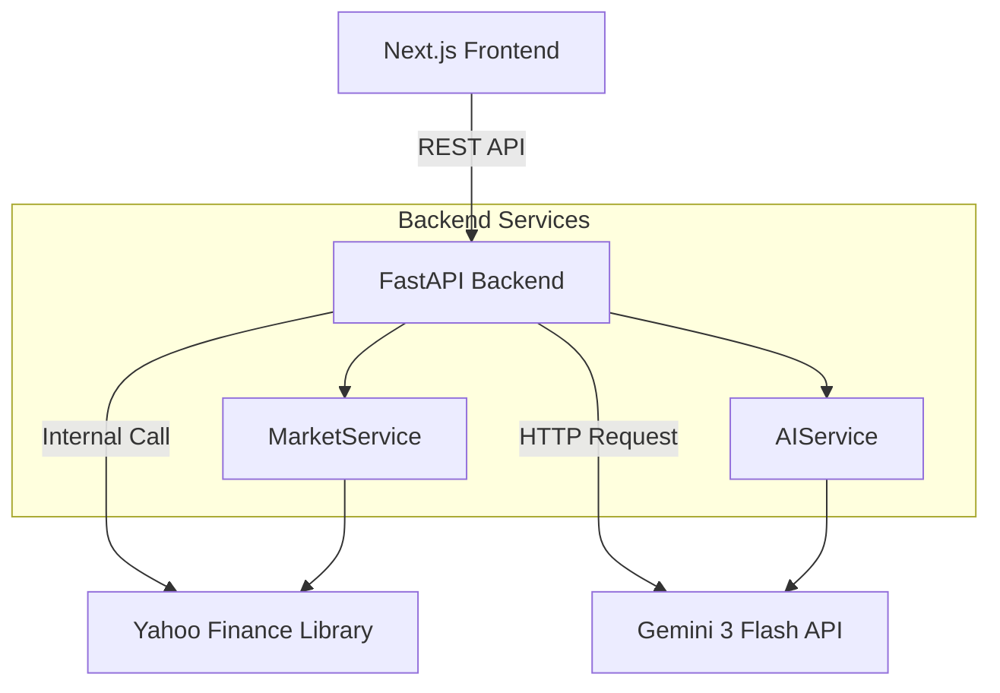
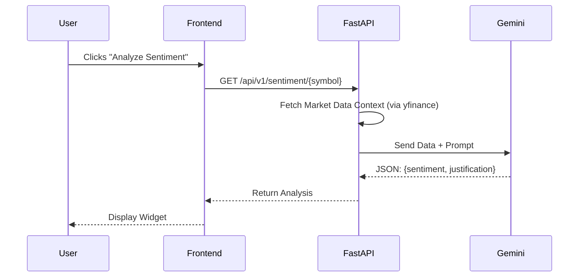

# System Architecture

## Overview

TraderPulse follows a clean, decoupled architecture:
- **Backend**: FastAPI (Python 3.12+) serving REST APIs.
- **Frontend**: Next.js 16 (React Server Components + Client Components) with shadcn/ui.
- **External Services**: Yahoo Finance (Market Data), Google Gemini (AI).

## System Data Flow

## AI Analysis Flow

## Component Architecture

For detailed breakdown of the internal architecture of each component, please refer to:

- **[Backend Architecture](./backend/ARCHITECTURE.md)**: Service layer patterns, Pydantic models, and API design.
- **[Frontend Architecture](./frontend/ARCHITECTURE.md)**: App Router structure, Client/Server components, and State Management.
