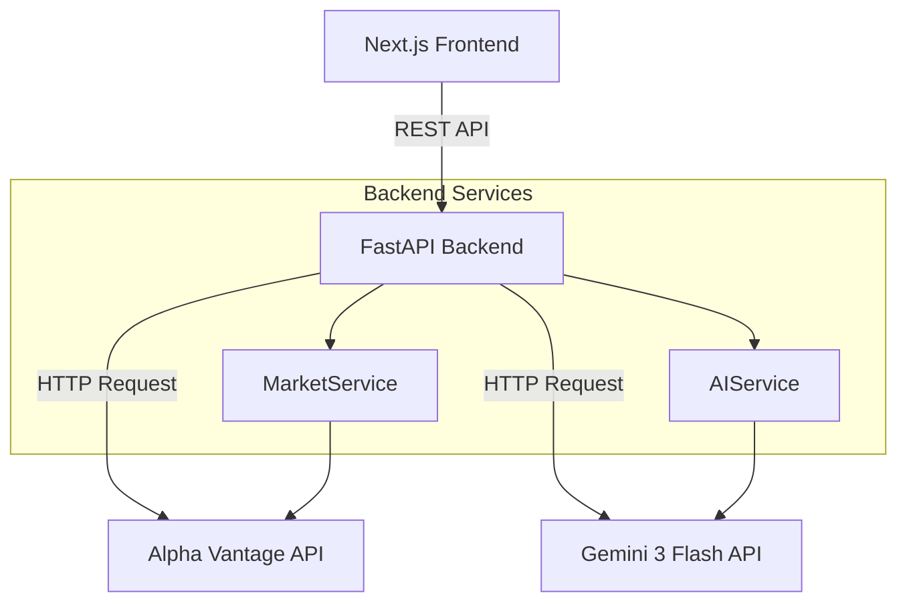
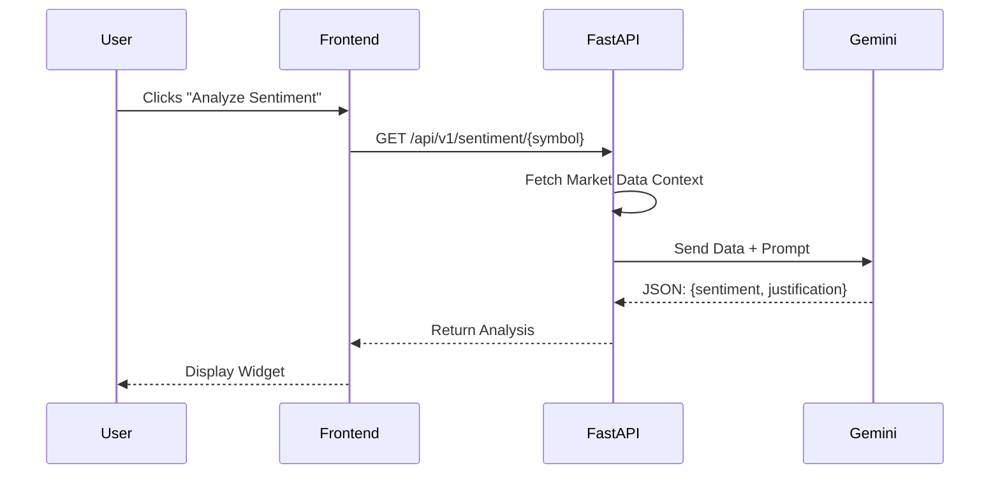

# Architecture Guide - TraderPulse

## Overview

TraderPulse follows a clean, decoupled architecture:
- **Backend**: FastAPI (Python 3.12+) serving REST APIs.
- **Frontend**: Next.js 16 (React Server Components + Client Components) with shadcn/ui.
- **External Services**: Alpha Vantage (Market Data), Google Gemini (AI).

## System Data Flow

## AI Analysis Flow

## Tech Stack Decisions

- **FastAPI**: High performance, native async support, perfect for IO-bound API proxying.
- **Next.js 16**: Latest features (App Router), server-side rendering for SEO and performance.
- **Tailwind + shadcn/ui**: Rapid UI development with accessible, beautiful components.
- **Gemini 3 Flash**: Low latency, high throughput model ideal for real-time user-facing applications.
